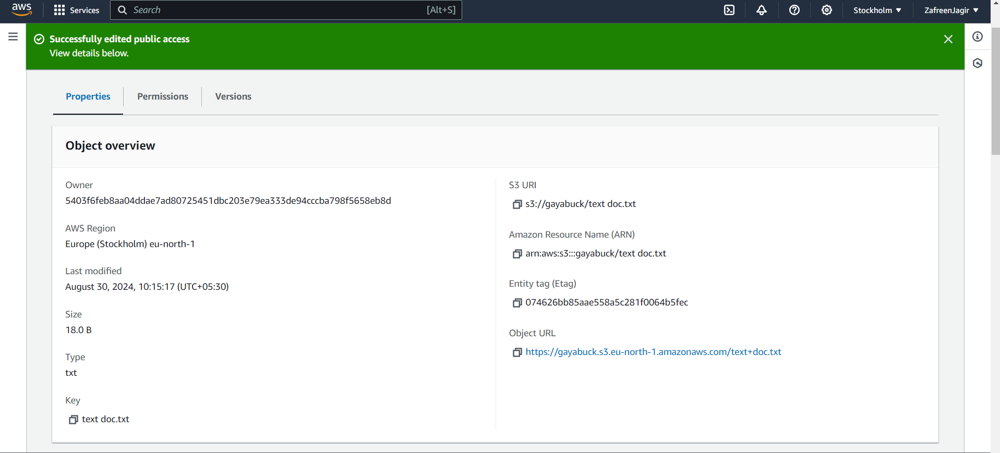
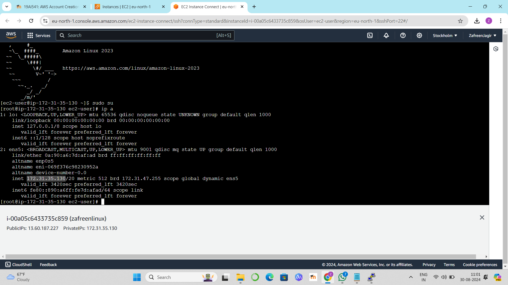
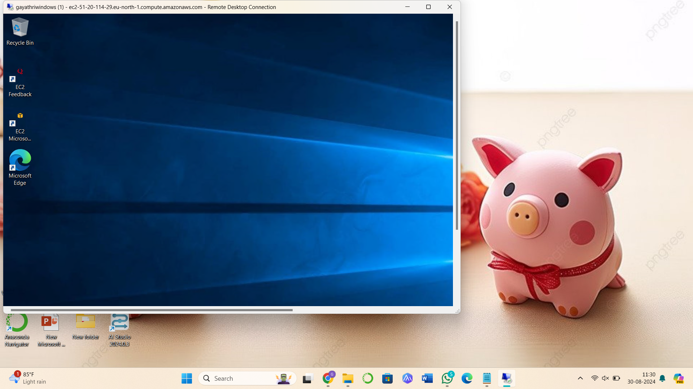

## CREATE S3 BUCKET AND EC2 INSTANCES FOR LINUX AND WINDOWS

## AIM
To Create S3 bucket and EC2 Instances for Linux and Windows.
## PROBLEM STATEMENT
This experiment aims to demonstrate the creation of an Amazon S3 bucket for storage purposes and the setup of EC2 instances for both Linux and Windows operating systems using AWS. Amazon S3 (Simple Storage Service) provides secure and scalable object storage, while EC2 (Elastic Compute Cloud) allows users to deploy virtual servers for computation and application hosting.

## ALGORITHM
 
## Step 1
Login to AWS Management Console:
  Open the AWS Management Console.
  Navigate to the S3 service for bucket creation and EC2 for instance setup.
## Step 2
Create an S3 Bucket:
Go to the S3 service.
Click on Create bucket.
Provide a unique Bucket Name and select the Region.
Configure additional settings as per requirements and click Create bucket.

## Step 3
Launch EC2 Instance (Linux):
Go to the EC2 service.
Click on Launch Instance.
Choose an Instance Type (e.g., t2.micro).
Configure instance settings, key pair, and security groups, then Launch the instance.

## Step 4
Launch EC2 Instance (Windows):
Repeat the EC2 launch steps but select a Windows Server AMI.
Complete instance configuration and Launch.

## Step 5
Connect to Instances


## Commands

```

S3 Bucket Creation
1.AWS CLI Command:
aws s3 mb s3:// --region
2.EC2 Instance (Linux) Commands:
Launch Linux EC2 instance and set up SSH access.
3.EC2 Instance (Windows) Commands:
Launch Windows EC2 instance and connect using RDP.

```

### REG NUMBER: 212222100048
### NAME: SATHISH R

## OUTPUT:
S3 Bucket:


LINUX Instance:


WINDOWS Instance:


 ## RESULT
S3 bucket and launch EC2 instances for Linux and Windows is successfully completed.

  


